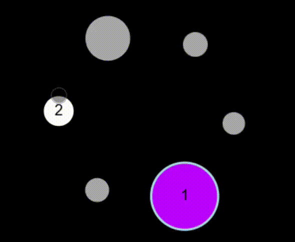

# SimpleKit Clicking Game

⚠️⚠️ **EASTER EGG**: Read the code to try and figure out the cheat command!! ⚠️⚠️

## Overview
A very simple clicking game to learn about SimpleKit JavaScript UI library.

## Running The Game
- Install packages: `npm install`
- Run server: `npm run dev`

## Rules

Click the nodes as they appear sequentially from 1 upwards.

The best time wins!

## Controls
- `Space` resets the node formation.
- `[` decreases the number of nodes (min 3)
- `]` increases the number of nodes (max 10)

### Easter Egg
Read the code to try and figure out the cheat command!!
